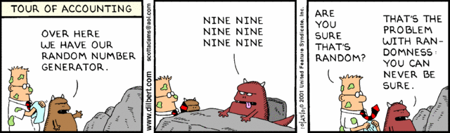

^My name is Steven, and my goal today is to get you to write this in more projects. Or any projects.
# [fit] ```import GameplayKit```

---


# My name is Steven Thompson
## I work at airG as an iOS Developer

---

^Also means we can use its tools anywhere it suits us

## [fit] What is GameplayKit? 
### Isn't that just for __games__

- "GameplayKit is a collection of foundational tools and technologies for building games in iOS, OS X, and tvOS" - *Apple*
- Independent of any game engine - can be used with SpriteKit, SceneKit, or none
- Not to be confused with GameController.framework, or GameKit.framework

--- 
^Seven parts:
^Entities & Components, State Machines, Agents, Pathfinding, MinMax AI, Random Sources, Rule Systems
Going to start with most relevant to apps, then get more gamey as we go


---
^Let's start with Random Sources. 
First, how do we currently do it?
# [fit] Let's talk randomness

---
^ Lots of ways to generate a number, in general you should arc4random_uniform
But is that the best way?
## Random number between 0 and N - 1
```rand() % N
random() % N
arc4random() % N
arc4random_uniform(N)```

---
^Sadly, swift is worse. No exchangeObjectAtIndex, need to use swap() and it sucks

## Shuffling an Array [^1]

```
NSMutableArray *mutableArray = [NSMutableArray arrayWithArray:array];
NSUInteger count = [mutableArray count];
// See http://en.wikipedia.org/wiki/Fisher–Yates_shuffle
if (count > 1) {
  for (NSUInteger i = count - 1; i > 0; --i) {
      [mutableArray exchangeObjectAtIndex:i withObjectAtIndex:arc4random_uniform((int32_t)(i + 1))];
  }
}

NSArray *randomArray = [NSArray arrayWithArray:mutableArray];
```

...really?

[^1]: Source: http://nshipster.com/random/

---
^I don't even know
## Generating a Normal (bell curve) distribution[^2]
```
double u1 = (double)arc4random() / UINT32_MAX; // uniform distribution
double u2 = (double)arc4random() / UINT32_MAX; // uniform distribution
double f1 = sqrt(-2 * log(u1));
double f2 = 2 * M_PI * u2;
double g1 = f1 * cos(f2); // gaussian distribution
double g2 = f1 * sin(f2); // gaussian distribution
```

...stop it

[^2]: Source: http://stackoverflow.com/a/12948538/2580195

---

# [fit] There's got to be a better way


---

## GameplayKit Style
```
//Random Number
let random = GKRandomDistribution(lowestValue: 25, highestValue: 75).nextInt()

//Normal Distribution
let normal = GKGaussianDistribution(randomSource: GKARC4RandomSource(), 
									 lowestValue: 0, 
									highestValue: 100).nextInt()

//Shuffled Array
let randomArray = GKARC4RandomSource().arrayByShufflingObjectsInArray(array)
```

---
^ Just use the ARC4 random
## Random Sources

ARC4: GKARC4RandomSource()
	- Best compromise.

Linear Congruential: GKLinearCongruentialRandomSource()
	- Least random, fastest.

Mersenne Twister: GKMersenneTwisterRandomSource()
	- Most random, but memory intensive

.sharedRandom() 
	- uses same source as system arc4random
	- Not identical to GKARC4RandomSource

---

## Simple random numbers

```
let source = GKARC4RandomSource()
source.nextInt() // 1624341145
source.nextUniform() // 0.0516789
source.nextBool() // true

// Within [0, upperBound]
source.nextIntWithUpperBound(100) // 32
```

---
^What if we want to control the distribution?
#### [fit] Was that a little... too random for you?

---

## GKShuffledDistribution

"Fair Random" - Avoids clustering while maintaining randomness over a large sample 



---

## GKGaussianDistribution

"Bell Curve" - biased towards the mean value


---

## Roll the dice
```
GKRandomDistribution.d6()
GKRandomDistribution.d20()
GKRandomDistribution.
	distributionForDieWithSideCount(37)
```

---

## Unique Sequence

Let's generate a unique sequence from 0 to N

```
func generateUniqueSequence(lowestValue: Int, 
						   highestValue: Int) -> [Int] {
    var ints: [Int] = []
    ints += lowestValue...highestValue
    return GKARC4RandomSource()
		.arrayByShufflingObjectsInArray(ints) as! [Int]
}

generateUniqueSequence(2, highestValue: 15) 
	//[15, 9, 6, 3, 2, 5, 10, 12, 7, 4, 13, 8, 11, 14]
```

---

## Final Notes
- Not suitable for cryptography
- arc4 algorithms have repeated initial sequences
	-> ```dropValuesWithCount(768)```
- GK Random Sources are great for deterministic randomness
	- Sources are serializable
	- You can provide a custom seed object


---

# [fit] State Machines

---

## A State Machine
Formally defines the various states your app can be in, and the rules that determine the transitions between them.

Can also be attached to any object, and there's no limit to the number you can use.

A state machine is always in exactly one state.

---

## How does it work?

1. Create your states, defining transitions
2. Create state machine with those states
3. Enter your first state

---
^updateWithDeltaTime is completely optional, makes more sense in a game with a constantly running game loop. But, easy to run your own NSTimer

## GKState
Each state is a custom subclass of GKState.

GKState objects get notified on entering/exiting the state, and on an update loop.

---
^Example, photo uploading
^updateWithDeltaTime is completely optional, makes more sense in a game with a constantly running game loop. But, easy to run your own NSTimer

## Custom State

```
class MyState: GKState {
	override func isValidNextState(stateClass: AnyClass) -> Bool { return true }
	
	override func didEnterWithPreviousState(previousState: GKState?) {}
	
	override func updateWithDeltaTime(seconds: NSTimeInterval) {}
	
	override func willExitWithNextState(nextState: GKState) {}
}
```

---

## GKStateMachine

A State machine is an instance of GKStateMachine

Create a state machine with *instances* of custom states.

Call enterState() on the *class*

```
let stateMachine = GKStateMachine(states: 
		[ ReadyState(object: self), 
		  UploadState(object: self), 
		  CompletedState(object: self) ])

stateMachine.enterState(ReadyState.self)
```

---
^Example StateMachine time
# [fit] **Let's break some MVC**

---

## Final Notes

- Great pattern, easy to add additional states
- Useful for app wide state, or object specific

---
# [fit] Entities & Components

---

## Very Briefly...
- A way to decompose your objects into multiple components of functionality
	- Example:

```
let entity = GKEntity()
let aComponent = AnimatingComponent()
entity.addComponent(aComponent)
// Optional Update Loop
entity.updateWithDeltaTime(deltaTime) // Propogates to components
```

---

## GKComponentSystem

Collection of the same components you want to call all at once.

For example, update all AnimationComponents at once to disable all animation.

---

# [fit] Agents, Goals & Behaviours

---

## GKAgent / GKAgent2D

- An agent is a point mass with velocity, radius, maxAcceleration, maxSpeed and rotation.
- Not tied to any visual representation.
- Is affected by behaviour when updateWithDeltaTime() is called.
- Use ```agentDidUpdate()``` to translate agent movement back to the visual representation.

---

## GKGoal

- A goal is a directive to try to achieve something, related to physical postion/motion.
- Many kinds of goal, all applying forces to agents.

---
^ Notice me fighting to spell things canadian
## GKBehavior

- A collection of goals and their weights, to be applied to an agent.

```
let behaviour = GKBehavior()
behaviour.setWeight(1.0, forGoal: 
	GKGoal(toSeparateFromAgents: agents, 
					maxDistance: separationRadius, 
				   	   maxAngle: separationAngle) )
agent.behavior = behaviour
```

---

## [fit] EXAMPLE

---

## Final Notes

- Takes a lot of fiddling to find good relative weights
- Simply add/remove goals and watch your agents start navigating differently.

---

^ Pathfinding gives you easy way to create a whole node graph, and calculate a shortest path
OHMYGOD Fuzzy logic I mean come on.

# Things I didn't get to

- Rule Systems! *Fuzzy logic*
- Pathfinding

---

# [fit] QUESTIONS?

---

# [fit] Thank you!


### @stevethomp

### https://github.com/stevethomp/VIDIA-GameplayKit